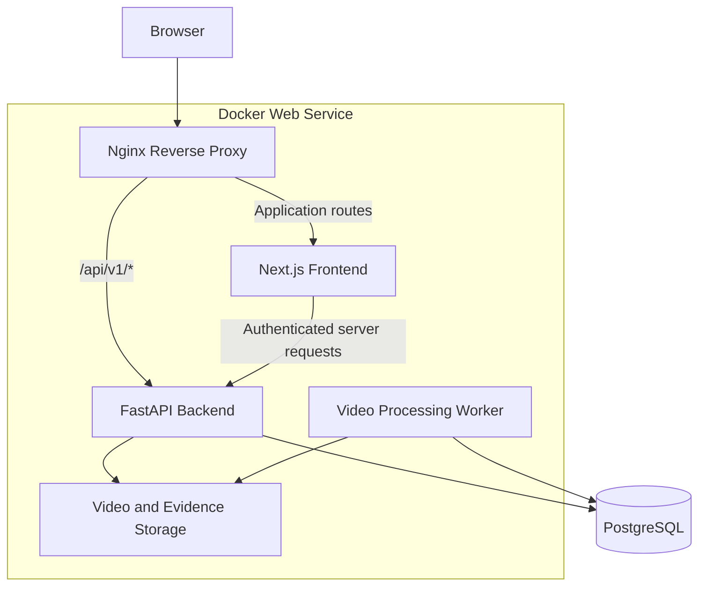

# Traffic Intelligence Platform

An AI-powered traffic monitoring and violation-review platform that processes road footage, detects traffic-rule violations, generates evidence, and supports authenticated human review workflows.

## Live Application

- **Live demo:** https://traffic-intelligence-platform-lq7f.onrender.com
- **Health endpoint:** https://traffic-intelligence-platform-lq7f.onrender.com/api/v1/ready
- **GitHub repository:** https://github.com/RaghulSayee/traffic-intelligence-platform

> Public administrator credentials are intentionally not included in this repository.

## Overview

The Traffic Intelligence Platform transforms uploaded traffic-surveillance footage into structured, reviewable violation events. It combines a Next.js operations dashboard, a FastAPI backend, PostgreSQL persistence, YOLO-based detection, multi-object tracking, scene-aware violation reasoning, evidence generation, authentication, and Docker-based deployment.

## Features

### Traffic Monitoring

- Register and manage traffic cameras
- Configure camera-specific road scenes
- Define lanes, monitoring zones, stop lines, and traffic-signal regions
- Configure allowed travel directions
- Enable supported violations per camera
- Validate scene readiness before processing

### Video Processing

- Upload traffic-surveillance videos
- Extract video metadata
- Create asynchronous processing jobs
- Track queued, running, completed, failed, and cancelled jobs
- Display processing progress and pipeline metrics
- Generate annotated preview videos
- Delete videos and related artifacts

### Computer Vision and Reasoning

- YOLO object detection
- Multi-object tracking
- Vehicle trajectory analysis
- Rider-to-motorcycle association
- Traffic-light state analysis
- Stop-line crossing detection
- Scene and lane geometry evaluation
- Detection-confidence and rule-confidence scoring

### Supported Violations

- Red-light violations
- Lane violations
- Wrong-way driving
- Triple riding
- No-helmet riding

### Violation Review

- View evidence images and annotated clips
- Confirm or reject detected violations
- Add reviewer notes
- Filter by violation type and review status
- Track pending-review totals
- Browse large result sets using pagination

## Technology Stack

### Frontend

- Next.js 16
- React
- TypeScript
- Tailwind CSS
- Lucide React
- Server Components
- Route Handlers
- Protected routes using Next.js Proxy

### Backend

- Python 3.12
- FastAPI
- SQLAlchemy Async
- Alembic
- Pydantic
- PostgreSQL
- PyJWT
- pwdlib with Argon2

### Computer Vision

- Ultralytics YOLO
- OpenCV
- SciPy
- Kalman-filter-based object tracking
- FFmpeg

### Infrastructure

- Docker
- Nginx
- Render
- Render PostgreSQL
- uv
- npm
- Git and GitHub

## System Architecture



### Request Routing

| Route | Destination |
|---|---|
| `/dashboard` | Next.js |
| `/cameras` | Next.js |
| `/videos` | Next.js |
| `/jobs` | Next.js |
| `/violations` | Next.js |
| `/analytics` | Next.js |
| `/api/v1/*` | FastAPI |

Nginx exposes the frontend and backend through the same production domain, allowing secure HttpOnly authentication cookies to work across the platform.

## Processing Pipeline

```mermaid
flowchart LR
    Upload[Video Upload] --> Metadata[Metadata Extraction]
    Metadata --> Job[Processing Job]
    Job --> Detection[YOLO Detection]
    Detection --> Tracking[Multi-Object Tracking]
    Tracking --> Scene[Scene and Lane Analysis]
    Scene --> Reasoning[Violation Reasoning]
    Reasoning --> Evidence[Evidence Generation]
    Evidence --> Review[Human Review]
```



1. A traffic video is uploaded through the dashboard.
2. The backend validates the file and extracts metadata.
3. A processing job is created and queued.
4. YOLO detects vehicles, motorcycles, riders, helmets, and traffic signals.
5. Multi-object tracking follows detections across frames.
6. Scene geometry maps tracked objects to configured lanes, regions, and stop lines.
7. Rule-based reasoning evaluates possible traffic violations.
8. Evidence images and annotated clips are generated.
9. Violation records and job metrics are stored in PostgreSQL.
10. An administrator or reviewer confirms or rejects each violation.

## Authentication and Authorization

### Authentication

- Users sign in with an email address and password.
- Passwords are hashed using Argon2.
- FastAPI issues JWT access tokens after successful authentication.
- Tokens are stored in HttpOnly cookies.
- Protected frontend pages require an authenticated session.
- Protected backend routes validate the current user and role.
- Internal server-to-server requests use a private API key.

### Administrator

Administrators can manage cameras, configure scenes, upload and delete videos, review violations, and create additional users.

### Reviewer

Reviewers can view platform resources, inspect evidence, confirm or reject violations, and add review notes. They cannot perform administrator-only resource mutations.

## Project Structure

```text
traffic-intelligence-platform/
├── backend/
│   ├── app/
│   │   ├── api/              # FastAPI routes
│   │   ├── artifacts/        # Generated media helpers
│   │   ├── core/             # Settings, authentication, and security
│   │   ├── db/               # Database configuration
│   │   ├── detection/        # YOLO detection components
│   │   ├── models/           # SQLAlchemy models
│   │   ├── pipelines/        # Video-processing pipeline
│   │   ├── reasoning/        # Violation reasoning
│   │   ├── repositories/     # Data-access layer
│   │   ├── scene/            # Scene geometry and validation
│   │   ├── schemas/          # Pydantic schemas
│   │   ├── services/         # Business logic
│   │   ├── storage/          # Video and evidence storage
│   │   ├── tracking/         # Multi-object tracking
│   │   └── workers/          # Background worker
│   ├── migrations/           # Alembic migrations
│   ├── scripts/              # Administrative scripts
│   └── tests/                # Backend test suite
├── frontend/
│   ├── public/
│   └── src/
│       ├── app/              # Next.js routes and pages
│       ├── components/       # Reusable UI components
│       ├── hooks/            # React hooks
│       ├── lib/              # API clients and utilities
│       └── types/            # TypeScript types
├── deploy/
│   ├── nginx.conf.template
│   └── start-production.sh
├── scripts/
├── Dockerfile
├── render.yaml
└── README.md
```

## Local Development

### Prerequisites

- Docker Desktop
- Python 3.12
- uv
- Node.js and npm
- FFmpeg
- Git

### Clone the Repository

```bash
git clone https://github.com/RaghulSayee/traffic-intelligence-platform.git
cd traffic-intelligence-platform
```

## Backend Setup

```bash
cd backend
uv sync
cp .env.example .env
docker compose up -d
uv run alembic upgrade head
uv run uvicorn app.main:app --reload
```

Backend endpoints:

- API: `http://localhost:8000`
- API documentation: `http://localhost:8000/docs`
- Readiness check: `http://localhost:8000/api/v1/ready`

### Start the Video Worker

Open another terminal:

```bash
cd backend
uv run python -m app.workers.run
```

## Frontend Setup

```bash
cd frontend
npm ci
```

Create `frontend/.env.local`:

```env
NEXT_PUBLIC_API_BASE_URL=http://localhost:8000/api/v1
BACKEND_API_BASE_URL=http://127.0.0.1:8000/api/v1
BACKEND_INTERNAL_API_KEY=replace-with-the-same-backend-internal-key
```

Start the frontend:

```bash
npm run dev
```

Open `http://localhost:3000`.

## Important Environment Variables

| Variable | Purpose |
|---|---|
| `DATABASE_URL` | PostgreSQL connection URL |
| `JWT_SECRET_KEY` | Signs JWT access tokens |
| `BACKEND_INTERNAL_API_KEY` | Protects internal server requests |
| `INITIAL_ADMIN_EMAIL` | Initial administrator email |
| `INITIAL_ADMIN_PASSWORD` | Initial administrator password |
| `INITIAL_ADMIN_NAME` | Initial administrator display name |
| `RUN_VIDEO_WORKER` | Enables or disables the processing worker |
| `NEXT_PUBLIC_API_BASE_URL` | Browser-facing backend API URL |
| `BACKEND_API_BASE_URL` | Server-side backend API URL |

Do not commit real credentials or production secrets.

## Automated Validation

### Backend

```bash
cd backend
uv run ruff format --check app tests scripts
uv run ruff check app tests scripts
uv run pytest -q
```

The backend currently includes 207 automated tests covering authentication, authorization, camera APIs, video endpoints, processing jobs, traffic-scene validation, detection and reasoning components, preview transcoding, health checks, CORS, and route security.

### Frontend

```bash
cd frontend
npm run lint
npm run build
```

## Production Docker Test

Build from the repository root:

```bash
docker build --progress=plain -t traffic-intelligence-platform:local .
```

Run with a configured environment file:

```bash
docker run -d \
  --name traffic-intelligence-local \
  --env-file .render-local.env \
  -p 10000:10000 \
  traffic-intelligence-platform:local
```

Open `http://localhost:10000` and verify readiness:

```bash
curl http://localhost:10000/api/v1/ready
```

Stop the container:

```bash
docker rm -f traffic-intelligence-local
```

## Deployment

The project is deployed using the Render Blueprint in `render.yaml`.

The production container runs Nginx, Next.js, FastAPI, and an optional processing worker. During startup, the deployment script applies Alembic migrations, bootstraps the initial administrator, starts the application services, and exposes Nginx on Render's assigned port.

## Public Deployment Limitations

The public deployment is configured for a resource-constrained environment:

- `RUN_VIDEO_WORKER` is disabled to reduce memory usage.
- Newly uploaded videos may remain queued online.
- Video and evidence files use temporary container storage.
- Files may disappear after a restart or redeployment.
- The production database is separate from the local database.
- Existing local data is not copied automatically.
- The service may require additional startup time after inactivity.

A larger production deployment should use a dedicated API service, a dedicated worker, persistent object storage, a permanent PostgreSQL plan, a task queue such as Redis, and structured monitoring.

## Roadmap

- Seeded public demonstration data
- Read-only recruiter demo account
- Persistent object storage
- Dedicated background worker
- Redis-backed task queue
- Live RTSP camera ingestion
- License-plate recognition
- Vehicle-speed estimation
- Notifications and alerts
- Audit logs
- User-management interface
- Expanded analytics and reporting
- Production observability

## Author

**Raghul Sayee**

MS Computer Science student at Northeastern University with experience in backend engineering, AI/ML systems, computer vision, full-stack development, and agentic AI platforms.

- GitHub: https://github.com/RaghulSayee
- Live project: https://traffic-intelligence-platform-lq7f.onrender.com

## Repository Notice

This project is intended for educational, research, demonstration, and portfolio use. Add a dedicated license file before distributing or reusing the code under a specific open-source license.
